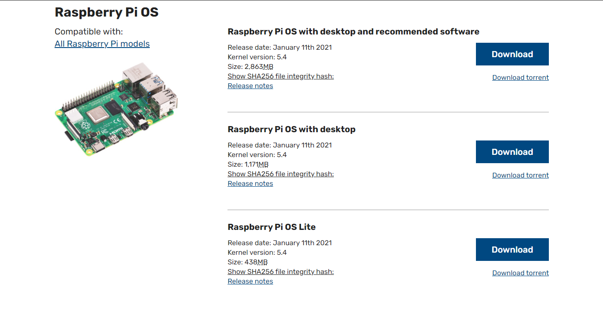

# NHL-LED-scoreboard


  
  

## UPDATE on 2021 Season (PLEASE READ)

The 2021 season is upon us. REJOICE !!!

  

This project rely on the undocumented NHL API and I have no control over it. the 2021 season as we know it is a different one and that will have an effect on this software. Your board might crash and not run sometimes. I suspect most of the changes, if there is any, will be found early on and I'll publish updates accordingly. Please keep an eye on the issue sections or open a new one if you believe what you are encounting has not been reported.

  

I also strongly recommand joining the discord channel to keep up with the updates and whats going on. And also you know. show off your setup which I enjoy.

  

Cheers

JJ

  

## Description

This is a Python software made to display NHL live scores, stats, and more of your favorite teams, on a Raspberry Pi driven RGB LED matrix. An LED matrix panel (also called a Dot led matrix or dot matrix) is a panel of LEDs used to build huge displays as you see in arenas, malls, time square, etc...

## Skill requirements (PLEASE READ)
I reckon that a lot of interest come from users that have little to no experience with a raspberry pi or computers and how to set up and use electronic devices in general. To help yourself here are some basic skills you need in order to set up and use this software and the device you are about to build. 

* Basic knowledge of Bash command language and terminal navigation. Here is a starting point https://www.raspberrypi.org/documentation/linux/usage/commands.md
* Basic Knowledge of Electronics. 
* Willingness to fail and keep trying.
* (Optional but recommended) Basic soldering skill. 

This documentation offers technical information related to the installation and execution of this software only. You will need to figure out other unrelated technical processes through tutorials or searching on google.


## Disclaimer

This project relies on an undocumented NHL API which is also what nhl.com use. The data is not always accurate and might have delays and errors that's out of our control.

  

## Tutorials from other source

>"I followed instructions from somewhere else and I'm having issues"

  

This project is new and is in constant evolution. Please read the documentation and instructions to install and run this software provided here.

  

## Support and community

We have a nice community growing every day on discord who shares the same passion for hockey, tinkering electronics, and making stuff. If you are curious about the development of the project, come join us by clicking on the button below.

  

<a  href="assets/images/community_4.jpg"  target="_blank"></a> <a  href="assets/images/community_2.jpg"  target="_blank"> </a><a  href="assets/images/community_1.jpg"  target="_blank"> </a> <a  href="assets/images/community_3.jpg"  target="_blank"> </a>

  

[](https://discord.gg/CWa5CzK)

  

Want to help me turn coffee into features? Or just want to contribute

for my work?

  

<a  href="https://www.buymeacoffee.com/MgDa5sr"  target="_blank"></a>

  
  
  

## Requirements

Since version V1.0.0 you need python 3.3 and up.


## Time and data accuracy
The scoreboard refreshes the data at a faster rate (15 seconds by default, don't go faster than 10). This does not change the fact that the data from the API is refreshed every minute. The faster refresh rate allows catching the new data from the API faster.

Syncing the scoreboard with a TV Broadcast is, to my knowledge, impossible. The delay between the actual game and the TV broadcast is different depending on where you are in relation to the game's location. This also means that you will see the goal animation before it happens on TV sometimes. I'm working on this issue and looking to find a solution to implement a delay at some point. 

Also, it might happen the data shown on board might be wrong for a short time, even goals. That is because the API is drunk. If you see data that might be wrong, compare it to the nhl.com and see if it's different.


## Hardware and Assembly
Please refer to the [Hardware page](https://github.com/riffnshred/nhl-led-scoreboard/wiki/Hardware) in the wiki section. You will find everything you need to order and build your scoreboard.  

**IMPORTANT NOTE**: Even tho there are other ways to run an rgb led matrix, I only support for the Adafruit HAT and Adafruit Bonnet. They have a great tutorial on how to install both of them on their website. Follow these steps until **STEP 5** to assemble your setup. https://learn.adafruit.com/adafruit-rgb-matrix-bonnet-for-raspberry-pi/driving-matrices

If you create an issue because you are having trouble running your setup and you are using something different, I will close it and tell you to buy the appropriate parts or to check the [rpi-rgb-led-matrix ](https://github.com/hzeller/rpi-rgb-led-matrix) repo.


## Software Installation

### Step 1 -  Raspberry Pi OS Lite

To be sure that you have the best performance possible, this project requires Raspberry Pi OS Lite.

This version does not have a GUI which allows the Pi to dedicate as much resource as possible to the scoreboard.




  

Follow these instructions to install Raspberry Pi OS Lite on your Raspberry Pi and once you are up and running comeback to

this page.
  

[Raspbian Buster Lite Installation](https://medium.com/@danidudas/install-raspbian-jessie-lite-and-setup-wi-fi-without-access-to-command-line-or-using-the-network-97f065af722e)


### Step 2 - Time Zones

Before you start installing anything, make sure your raspberry pi is set to your local time zone. Usually, you do so when you install Raspian, but if you think you skipped that part, you can change it by running `sudo raspi-config`

  

### Step 3 - Installing Git

You will need to install Git on your raspberry pi in order to download the software. To do so, run this command.

`sudo apt install git`

  

### Step 4 - Installing the NHL scoreboard software

This installation process might take some time because it will install all the dependencies listed below.

  

```

git clone --recursive https://github.com/riffnshred/nhl-led-scoreboard

cd nhl-led-scoreboard/

chmod +x scripts/install.sh

./scripts/install.sh

```

  

[rpi-rgb-led-matrix ](https://github.com/hzeller/rpi-rgb-led-matrix/tree/master/bindings/python#building): The open-source library that allows the Raspberry Pi to render on the LED matrix.

[requests](https://requests.kennethreitz.org/en/master/): To call the API and manipulate the received data.

#### Updating your software.

```
git reset --hard

git checkout master

git pull

chmod +x scripts/install.sh

./scripts/install.sh

```

If you face any issue after updating, rerun the install and it should fix it. otherwise check the issue section to see if a solution as been found for your problem. If not open an issue and I'll find a solution.

### Step 5 - Configuring your scoreboard.

**note** Since V1.1.2, you won't need to reconfigure your board everytime you update, **UNLESS** we add a major feature or we make a major update. There is 2 way to configure you board:


#### Using the nhl_setup app (recommended)


  

From the root of the `nhl-led-scoreboard`, run this command: `./nhl_setup`. Please take a look at the documentation here: [src/nhl_setup/README.md](https://github.com/riffnshred/nhl-led-scoreboard/tree/master/src/nhl_setup)

  

**New with v1.5.0**

You can now edit your current file instead of creating a new one.

  

#### Configuring manualy.

If you have no issue working with json files in a prompt, you can still configure manualy.

FIRST, you will need to make a copy of the config.json.sample and rename it config.json. Then open it and modify the options.

If it's a first install of the software, there is no config.json only a config.json.sample. This is normal. You need to configure your scoreboard. Fallow the steps in the [Configuration](#configuration) section of this documentation.

 

### Step 6 - Testing and Optimization 

If you have been using a Led matrix on a raspberry pi before and know how to run it properly skip this part.

  

If you just bought your Led matrix and want to run this software right away, first thank you. Second, don't get too excited just yet.

Depending on your setup, you will need to configure the scoreboard using specific command flags when you run it.

  

To do so, start by disabling the audio of the raspberry pi (this is a must to run the led matrix properly).

From the root of the pi open the boot config file like so.

```

sudo nano /boot/config.txt

```

  

Find `dtparam=audio=on` and change it to `dtparam=audio=off`.

  

Save and close the file like so

```

Press Control-x

Press y

Press [enter]

```

reboot the pi

```

sudo reboot now

```

Now let's show something on the screen. Get to the matrix submodule and run some samples.

  

```

cd nhl-led-scoreboard/submodules/matrix/bindings/python/samples

sudo python3 runtext.py --led-rows=32 --led-cols=64 --led-gpio-mapping=adafruit-hat --led-brightness=60

```

**If you've done the anti-flickering mod**, use this flag instead `--led-gpio-mapping=adafruit-hat-pwm`

You should see "Hello World" scroll on screen.

Reference the [rpi-rgb-led-matrix library](https://github.com/hzeller/rpi-rgb-led-matrix/). Check out the section that uses the python bindings and run some of their examples on your screen. For sure you will face some issues at first, but don't worry, more than likely there's a solution you can find in their troubleshooting section.

Once you found out how to make it run smoothly, come back here and do what's next.

### Flags

This is a list of Flags you can use to optimize your screen's performance. For more details check out the [rpi-rgb-led-matrix library](https://github.com/hzeller/rpi-rgb-led-matrix/).

  

```

--led-rows Display rows. 16 for 16x32, 32 for 32x32 and 64x32. (Default: 32)

--led-cols Panel columns. Typically 32 or 64. (Default: 32)

--led-chain Daisy-chained boards. (Default: 1)

--led-parallel For Plus-models or RPi2: parallel chains. 1..3. (Default: 1)

--led-pwm-bits Bits used for PWM. Range 1..11. (Default: 11)

--led-brightness Sets brightness level. Range: 1..100. (Default: 100)

--led-gpio-mapping Hardware Mapping: regular, adafruit-hat, adafruit-hat-pwm

--led-scan-mode Progressive or interlaced scan. 0 = Progressive, 1 = Interlaced. (Default: 1)

--led-pwm-lsb-nanosecond Base time-unit for the on-time in the lowest significant bit in nanoseconds. (Default: 130)

--led-show-refresh Shows the current refresh rate of the LED panel.

--led-slowdown-gpio Slow down writing to GPIO. Range: 0..4. (Default: 1)

--led-no-hardware-pulse Don't use hardware pin-pulse generation.

--led-rgb-sequence Switch if your matrix has led colors swapped. (Default: RGB)

--led-pixel-mapper Apply pixel mappers. e.g Rotate:90, U-mapper

--led-row-addr-type 0 = default; 1 = AB-addressed panels. (Default: 0)

--led-multiplexing Multiplexing type: 0 = direct; 1 = strip; 2 = checker; 3 = spiral; 4 = Z-strip; 5 = ZnMirrorZStripe; 6 = coreman; 7 = Kaler2Scan; 8 = ZStripeUneven. (Default: 0)

```

  

### Best Performance

Using either a raspberry Zero, 3B+, 3A+ and 4B with an Adafruit HAT or Bonnet, here's what I did to run my board properly.

  

- Do the hardware mod found in the [Improving flicker section](https://github.com/hzeller/rpi-rgb-led-matrix#improving-flicker).

- Disable the onboard sound. You can find how to do it from the [Troubleshooting sections](https://github.com/hzeller/rpi-rgb-led-matrix#troubleshooting)

- From the same section, run the command that removes the Bluetooth firmware, Unless you use any Bluetooth device with your Pi.

  

Finally, these are the flag I use. (ONLY USE THESE FLAGS IF YOU'VE DONE THE HARDWARD ANTI-FLICKERING

MOD. If not, replace the first flag with --led-gpio-mapping=adafruit-hat).

  

```

--led-gpio-mapping=adafruit-hat-pwm --led-brightness=60 --led-slowdown-gpio=2

```


  


## Shout-out

  

First, these two for making this repo top notch and already working on future versions:

  

- [Josh Kay](https://github.com/joshkay)

- [Sean Ostermann](https://github.com/falkyre)

  
  

This project was inspired by the [mlb-led-scoreboard](https://github.com/MLB-LED-Scoreboard/mlb-led-scoreboard). Go check it out and try it on your board, even if you are not a baseball fan, it's amazing.

I also used this [nhlscoreboard repo](https://github.com/quarterturn/nhlscoreboard) as a guide at the very beginning as I was learning python.

  

You all can thank [Drew Hynes](https://gitlab.com/dword4) for his hard work on documenting the free [nhl api](https://gitlab.com/dword4/nhlapi).

  

## Licensing

This project uses the GNU Public License. If you intend to sell these, the code must remain open source.
