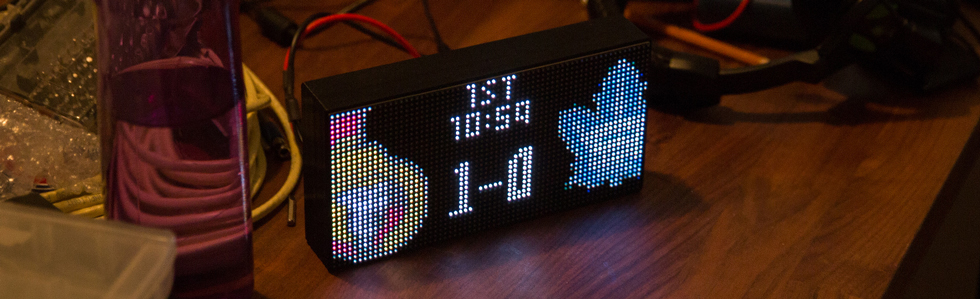

# NHL-LED-scoreboard


Display NHL score of your favorite team's game on a Raspberry Pi driven RGB LED 
matrix. Currently supports 64x32 boards only.

### Shout-out (Credit)
This project was inspired by the [mlb-led-scoreboard](https://github.com/MLB-LED-Scoreboard/mlb-led-scoreboard). Go check it out and try it on your board, even if you are not a baseball fan, it's amazing.
I also used this [nhlscoreboard repo](https://github.com/quarterturn/nhlscoreboard) as a guide at the very beginning as I was learning python.

## Contribution
Until I release V 1.0.0, which I aim to complete by the end of January, I won't accept any major pullrequest as the application change completely.

## Features (V 0.1.0)

### Live game 
Display the live score in near real time (refresh every minute) of a 
select game (set in the config file). If one of the team score a goal, 
a goal animation (.gif) is played.

### Game day
If your team has a game scheduled, The screen will display a preview 
screen of the game.

### Off day
Display a message to announce the sad news.

### Time and data accuracy
Syncing the scoreboard with a TV Broadcast is, to my knowledge, impossible. The delay between the actual game and the TV broadcast is different depending on where you are in relation to the game's location. I use the NHL API which will refresh and show scores before the TV broadcast. That means that most of the time, the scoreboard will show the goal before you see it happen on the TV.

During a live game, the stats will refresh every minute. This is because generally, the API refresh at the same rate. Also, the API update to the new day at 4 PM UTC (At noon EST time). The scoreboard will fallow that update in the hour following this.

If you see the scoreboard doesn't show the right state or stats, just quit and re-run it.

## Installation
### Hardware Assembly
While writing this README page, I realized that the mlb-led-scoreboard guys made a great wiki page to cover the hardware part of the project. 
[See the mlb-led-scoreboard wiki page.](https://github.com/MLB-LED-Scoreboard/mlb-led-scoreboard/wiki)

### Software Installation
#### Raspbian Distribution
It is recommended you install the Lite version of Raspbian from the [Raspbian Downloads Page](https://www.raspberrypi.org/downloads/raspbian/). This version lacks a GUI, allowing your Pi to dedicate more system resources to drawing the screen.

#### Time Zones
Before you start installing anything, make sure your raspberry pi is set to your local time zone. Usually, you do so when you install Raspian, but if you think you skipped that part, you can change it by running `sudo raspi-config`

#### Requirements
You need Git for cloning this repo and PIP for installing the scoreboard software.
```
sudo apt-get update
sudo apt-get install git python-pip
```

#### Installing the NHL scoreboard software
This installation process might take some time because it will install all the dependencies listed below.

```
git clone --recursive https://github.com/riffnshred/nhl-led-scoreboard
cd nhl-led-scoreboard/
sudo chmod +x install.sh
sudo ./install.sh
```
[rpi-rgb-led-matrix ](https://github.com/hzeller/rpi-rgb-led-matrix/tree/master/bindings/python#building): The open-source library that allows the Raspberry Pi to render on the LED matrix.

[pytz](http://pytz.sourceforge.net/), [tzlocal](https://github.com/regebro/tzlocal): Timezone libraries. These allow the scoreboard to convert times to your local timezone.

[requests](https://requests.kennethreitz.org/en/master/): To call the API and manipulate the received data.

## Testing & Optimization (IMPORTANT)
If you have been using a Led matrix on a raspberry pi before and know how to run it properly skip this part. 

If you just bought your Led matrix and want to run this software right away, first thank you. Second, don't get to excited just yet.

Reference the [rpi-rgb-led-matrix library](https://github.com/hzeller/rpi-rgb-led-matrix/). Check out the section that uses the python bindings and run some of their examples on your screen. For sure you will face some issues at first, but don't worry, more than likely there's a solution you can find in their troubleshooting section.
Once you found out how to make it run smoothly, come back here and do what's next.

### Adafruit HAT/bonnet
If you are using any thing from raspberry pi 3+ to the newest versions with an Adafruit HAT or Bonnet, here's what I did to run my board properly.

* Do the hardware mod found in the [Improving flicker section ](https://github.com/hzeller/rpi-rgb-led-matrix#improving-flicker).
* Disable the on-board sound. You can find how to do it from the [Troubleshooting sections](https://github.com/hzeller/rpi-rgb-led-matrix#troubleshooting)
* From the same section, run the command that remove the bluetooth firmware, Unless you use any bluetooth device with your Pi.

Finally, here's the command I use. 
```
sudo python main.py --led-gpio-mapping=adafruit-hat-pwm --led-brightness=60 --led-slowdown-gpio=2
```

## Usage
First thing first, find your fav team's id number.

| Team                  | ID |   | Team                 | ID |
|-----------------------|----|---|----------------------|----|
| Anaheim Ducks         | 24 |   | Nashville Predators  | 18 |
| Arizona Coyotes       | 53 |   | New Jersey Devils    | 1  |
| Boston Bruins         | 6  |   | New York Islanders   | 2  |
| Buffalo Sabres        | 7  |   | New York Rangers     | 3  |
| Calgary Flames        | 20 |   | Ottawa Senators      | 9  |
| Carolina Hurricanes   | 12 |   | Philadelphia Flyers  | 4  |
| Chicago Blackhawks    | 16 |   | Pittsburgh Penguins  | 5  |
| Colorado Avalanche    | 21 |   | San Jose Sharks      | 28 |
| Columbus Blue Jackets | 29 |   | St Louis Blues       | 19 |
| Dallas Stars          | 25 |   | Tampa Bay Lightning  | 14 |
| Detroit Red Wings     | 17 |   | Toronto Maple Leafs  | 10 |
| Edmonton Oilers       | 22 |   | Vancouver Canucks    | 23 |
| Florida Panthers      | 13 |   | Vegas Golden Knights | 54 |
| Los Angeles Kings     | 26 |   | Washington Capitals  | 15 |
| Minnesota Wild        | 30 |   | Winnipeg Jets        | 52 |
| Montreal Canadiens    | 8  |   |                      |    |


Open the config.json file from the root folder and change the `"fav_team_id"` to your favorite team's id. This will make the scoreboard to fallow
your team by default. Otherwise... GO HABS GO !!!!

Now, in a terminal, cd to the nhl-led-scoreboard folder and run this command. 
```
sudo python main.py 
```
**If you run your screen on an Adafruit HAT or Bonnet, you need to supply a flag.**
```
sudo python main.py --led-gpio-mapping=adafruit-hat
```

### Flags
Use the same flags used in the [rpi-rgb-led-matrix ](https://github.com/hzeller/rpi-rgb-led-matrix/) library to configure your screen.
```
--led-rows                Display rows. 16 for 16x32, 32 for 32x32. (Default: 32)
--led-cols                Panel columns. Typically 32 or 64. (Default: 32)
--led-chain               Daisy-chained boards. (Default: 1)
--led-parallel            For Plus-models or RPi2: parallel chains. 1..3. (Default: 1)
--led-pwm-bits            Bits used for PWM. Range 1..11. (Default: 11)
--led-brightness          Sets brightness level. Range: 1..100. (Default: 100)
--led-gpio-mapping        Hardware Mapping: regular, adafruit-hat, adafruit-hat-pwm
--led-scan-mode           Progressive or interlaced scan. 0 = Progressive, 1 = Interlaced. (Default: 1)
--led-pwm-lsb-nanosecond  Base time-unit for the on-time in the lowest significant bit in nanoseconds. (Default: 130)
--led-show-refresh        Shows the current refresh rate of the LED panel.
--led-slowdown-gpio       Slow down writing to GPIO. Range: 0..4. (Default: 1)
--led-no-hardware-pulse   Don't use hardware pin-pulse generation.
--led-rgb-sequence        Switch if your matrix has led colors swapped. (Default: RGB)
--led-pixel-mapper        Apply pixel mappers. e.g Rotate:90, U-mapper
--led-row-addr-type       0 = default; 1 = AB-addressed panels. (Default: 0)
--led-multiplexing        Multiplexing type: 0 = direct; 1 = strip; 2 = checker; 3 = spiral; 4 = Z-strip; 5 = ZnMirrorZStripe; 6 = coreman; 7 = Kaler2Scan; 8 = ZStripeUneven. (Default: 0)
```
I also created a flag to change which team to fallow instead of the default team. 
```
--fav-team                Select a team to follow by using it's ID (Default: 8 "Montreal Canadiens") 
```

## Licensing
This project use the GNU Public License. If you intend to sell these, the code must remain open source.

## NHL LOGOS COPYRIGHT
I do not own the NHL logos used in this project. NHL and the NHL Shield are registered trademarks of the National Hockey League. All NHL logos and marks and NHL team logos and marks depicted herein are the property of the NHL and the respective teams and may not be reproduced without the prior written consent of NHL Enterprises, L.P. © NHL. All Rights Reserved.
