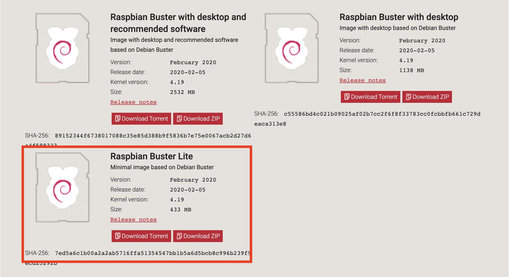
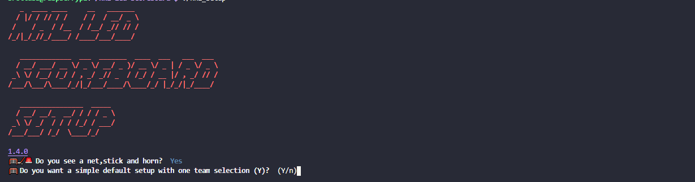
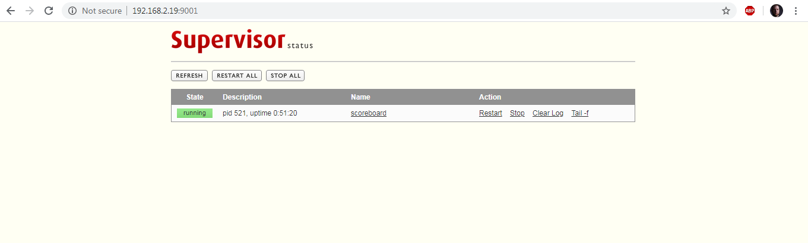

# NHL-LED-scoreboard


## UPDATE on 2021 Season (PLEASE READ)
The 2021 season is upon us. REJOICE !!!

This project rely on the undocumented NHL API and I have no control over it. the 2021 season as we know it is a different one and that will have an effect on this software. Your board might crash and not run sometimes. I suspect most of the changes, if there is any, will be found early on and I'll publish updates accordingly. Please keep an eye on the issue sections or open a new one if you believe what you are encounting has not been reported.

I also strongly recommand joining the discord channel to keep up with the updates and whats going on. And also you know. show off your setup which I enjoy. 

Cheers
JJ

## Description
This is a Python software made to display NHL live scores, stats, and more of your favorite teams, on a Raspberry Pi driven RGB LED matrix. An LED matrix panel (also called a Dot led matrix or dot matrix) is a panel of LEDs used to build huge displays as you see in arenas, malls, time square, etc...

## Disclaimer 
This project relies on an undocumented NHL API which is also what nhl.com use. The data is not always accurate and might have delays and errors that's out of our control.

## Tutorials from other source
>"I followed instructions from somewhere else and I'm having issues"

This project is new and is in constant evolution. Please read the documentation and instructions to install and run this software provided here. 

## Support and community
We have a nice community growing every day on discord who shares the same passion for hockey, tinkering electronics, and making stuff.  If you need help or you are curious about the development of the project, come join us by clicking on the button below.

<a href="assets/images/community_4.jpg" target="_blank"></a> <a href="assets/images/community_2.jpg" target="_blank">  </a><a href="assets/images/community_1.jpg" target="_blank"> </a> <a href="assets/images/community_3.jpg" target="_blank"> </a>

[](https://discord.gg/CWa5CzK)

Want to help me turn coffee into features? Or just want to contribute
for my work? 

<a href="https://www.buymeacoffee.com/MgDa5sr" target="_blank"></a>


## Requirements
Since version V1.0.0 you need python 3.3 and up.


## Table of Contents
  - [Features](#features)
  - [Time and data accuracy](#time-and-data-accuracy)
  - [Installation](#installation)
    - [Hardware Assembly](#hardware-assembly)
      - [Installing and configuring a button.](#installing-and-configuring-a-button)
    - [Software Installation](#software-installation)
      - [Raspbian Buster Lite](#raspbian-buster-lite)
      - [Time Zones](#time-zones)
      - [Installing the NHL scoreboard software](#installing-the-nhl-scoreboard-software)
    - [*Important Step after installation.*](#important-step-after-installation)
      - [Updating your software.](#updating-your-software)
  - [Testing and Optimization](#testing-and-optimization)
    - [Flags](#flags)
    - [Best Performance](#best-performance)
  - [Configuration](#configuration)
      - [Using the nhl_setup app (recommended)](#using-the-nhl_setup-app-recommended)
      - [Configuring manualy.](#configuring-manualy)
    - [Modes](#modes)
    - [Preferences](#preferences)
    - [Goal Animations](#goal-animations)
    - [Teams](#teams)
    - [States](#states-1)
    - [Boards](#boards)
    - [Dimmer](#dimmer-1)
  - [Usage](#usage)
    - [Method 1 Using Supervisor](#method-1-using-supervisor)
    - [Method 2 Using Terminal Multiplexer](#method-2-using-terminal-multiplexer)
    - [Terminal Mode](#terminal-mode)
  - [Shout-out](#shout-out)
  - [Licensing](#licensing)
  


## Features

### States
Depending on the situation, the scoreboard will operate in a different state. For example, If your team is off today, the scoreboard will be in the "Offday" State. This allows showing specific boards (see Boards) depending on the state of the unit.

-   **Offday**: When your favorite teams don't have any scheduled games for the day
-   **Scheduled**: When one of your preferred team has a game scheduled on the current day, the scoreboard will rotate through a list of boards set by the user in the config file.
-   **Live game**: Display the live score in near real-time of your favorite game. If one of the team scores a goal, a goal animation (.gif) is played.
-   **Intermission**: Between periods, the scoreboard will rotate through a list of boards set for the intermission state by the user in the config file.
-   **Post-game**: Once the game is over, the scoreboard will rotate through a list of boards set for the Post-game state by the user in the config file.

### Board rotation System
   

The board system allows the user to choose what to display depending on the state of the scoreboard. For example: While the game I'm watching is in the intermission state, I like to see the score ticker, which is showing the score of the other games.

There are currently three different boards available:

-   **Score Ticker**: A carousel that cycles through the games of the day.
-   **Team Summary**: Display your preferred team's summary. It displays their standing record, the result of their previous game and the next game on their schedule.
-   **Standings**: Display the standings either by conference or by division. The Wildcard is currently not available, due to the NHL API not providing the info, this will probably be back for next season.
-   **Series Ticker**: A slider that display each bracket and the result of each games of the series.
-   **Stanley cup Champions**: Display the current Stanley cup champions.


Non-hockey boards:
-   **Clock**: a basic clock. (***NEW***: Now with the option to show basic weather information and weather alert. More details [here](https://github.com/riffnshred/nhl-led-scoreboard/tree/beta/src/api/weather))
-   **Weather**: Display weather information and also provide weather alerts.
-   **Covid-19**: Show the number of cases, deaths and recovered cases of the covid-19 virus in real time (API updates about every 15 min).
-   **Christmas Count down**: Show how many days are left until Christmas

The board system also allows to easily integrate new features. For example, if you want to have a clock displayed during the day along with other boards, or if you wish one of the existing boards would show something different, you can make your own and integrate it without touching the main software. I strongly suggest you play around with the python examples in the [rpi-rgb-led-matrix](https://github.com/hzeller/rpi-rgb-led-matrix/tree/master/bindings/python#building) to learn how to display anything on the matrix.

More will come soon with playoff related features

### Goal animation

When ever a team in the main event score a goal, a goal light animation is played.
Soon you will have to option to set the animation for your favorite team only or play a different animation for
the opposing team.

### Dimmer
The scoreboard now has a dimmer function. The scoreboard will change its brightness at sunrise and sunset. If you have
a [TSL2591](https://www.adafruit.com/product/1980) light sensor installed on your raspberry pi, you can configure the scoreboard
to use it to adjust the brightness.

### Indicators
Because of its size, I programmed some indicators to display more information without filling up the screen and create an information overload issue. Please read the [Indicators](https://github.com/riffnshred/nhl-led-scoreboard/wiki/Indicators) page in the Wiki section for more details.

   

### Screensaver
**NEW for V1.5.0**
You can now setup a screensaver and you can either use a gif animation by simply adding a gif under `assets/animations/screensaver` or leave the folder empty to just have the screen off. See the [Configuration](#configuration) section below for more details.

### Update checker
Now the scoreboard has an Update checker option where it will show a green line on top of the screen if there is a new Major or minor update. To use it simply add the `--updatecheck` flag to the command line you use to run the board and set it to true of false like so `--updatecheck=True`.

If you are using an other repo that is a fork of this one you can set to check that repo for updates instead like so: `--updaterepo="user/nameoftherepo"`. The repo can be the name (eg `riffnshred/nhl-led-scoreboard`) or the github URL (eg `https://github.com/riffnshred/nhl-led-scoreboard`).

### Weather
This project has a nice weather app developped by [Sean Ostermann](https://github.com/falkyre). Check out the [Weather app](https://github.com/riffnshred/nhl-led-scoreboard/tree/master/src/api/weather) README for more details and all it's features.

**NEW for V1.5.0**
The weather app now has a weather forecast board (wxforecast) that show up to 3 days forcast.

## Time and data accuracy
For this version, the scoreboard refreshes the data at a faster rate (15 seconds by default, don't go faster than 10). This does not change the fact that the data from the API is refreshed every minute. The faster refresh rate allows catching the new data from the API faster.

Syncing the scoreboard with a TV Broadcast is, to my knowledge, impossible. The delay between the actual game and the TV broadcast is different depending on where you are in relation to the game's location. This also means that you will see the goal animation before it happens on TV. I'm working on this issue and looking to find a solution to implement
a delay.

Also, it might happen the data shown on board might be wrong for a short time, even goals. That's because the API is drunk. If you see data that might be wrong, compare it to the nhl.com and see if it's different. 

## Installation

### Hardware Assembly
**IMPORTANT NOTE**: Even tho there are other ways to run an rgb led matrix, I only support for the Adafruit HAT and Adafruit Bonnet.
If you create an issue because you are having trouble running your setup and you are using something different, I will close it and tell you to buy the
appropriate parts or to check the [rpi-rgb-led-matrix ](https://github.com/hzeller/rpi-rgb-led-matrix) repo.

Please refer to the [Home page](https://github.com/riffnshred/nhl-led-scoreboard/wiki/Home) and [Hardware page](https://github.com/riffnshred/nhl-led-scoreboard/wiki/Hardware) in the wiki section. You will find everything you need to order and build your scoreboard.

#### Installing and configuring a button.
To install and configure a button, please refer the well writen and detailed documentation in the SBIO section here: 
[src/sbio/SBIO.md](https://github.com/riffnshred/nhl-led-scoreboard/blob/master/src/sbio/SBIO.md). 

### Software Installation
#### Raspbian Buster Lite

To be sure that you have the best performance possible, this project requires Raspbian Buster Lite.
This version does not have a GUI which allows the Pi to dedicate as much resource as possible to the scoreboard.



Follow these instructions to install Raspbian Buster Lite on your Raspberry Pi and once you are up and running comeback to 
this page.

[Raspbian Buster Lite Installation](https://medium.com/@danidudas/install-raspbian-jessie-lite-and-setup-wi-fi-without-access-to-command-line-or-using-the-network-97f065af722e)


#### Time Zones
Before you start installing anything, make sure your raspberry pi is set to your local time zone. Usually, you do so when you install Raspian, but if you think you skipped that part, you can change it by running `sudo raspi-config`

#### Intalling Git
You will need to install Git on your raspberry pi in order to download the software. To do so, run this command. 
`sudo apt install git`

#### Installing the NHL scoreboard software
This installation process might take some time because it will install all the dependencies listed below.

```
git clone --recursive https://github.com/riffnshred/nhl-led-scoreboard
cd nhl-led-scoreboard/
chmod +x scripts/install.sh
./scripts/install.sh
```

[rpi-rgb-led-matrix ](https://github.com/hzeller/rpi-rgb-led-matrix/tree/master/bindings/python#building): The open-source library that allows the Raspberry Pi to render on the LED matrix.
[requests](https://requests.kennethreitz.org/en/master/): To call the API and manipulate the received data.

### *Important Step after installation.*
If it's a first install of the software, there is no config.json only a config.json.sample. This is normal. You need to configure your scoreboard. Fallow the steps in the [Configuration](#configuration) section of this documentation.


#### Updating your software.
```
git reset --hard
git checkout master
git pull
chmod +x scripts/install.sh
./scripts/install.sh
```

If you face any issue after updating, rerun the install and it should fix it. otherwise check the issue section to see if a solution as been found for your problem. If not open an issue and I'll find a solution.


## Testing and Optimization
If you have been using a Led matrix on a raspberry pi before and know how to run it properly skip this part. 

If you just bought your Led matrix and want to run this software right away, first thank you. Second, don't get too excited just yet.
Depending on your setup, you will need to configure the scoreboard using specific command flags when you run it.

To do so, start by disabling the audio of the raspberry pi (this is a must to run the led matrix properly).
From the root of the pi open the boot config file like so.
```
sudo nano /boot/config.txt
```

Find `dtparam=audio=on` and change it to `dtparam=audio=off`.

Save and close the file like so
```
Press Control-x
Press y
Press [enter]
```
reboot the pi
```
sudo reboot now
```

Now let's show something on the screen. Get to the matrix submodule and run some samples.

```
cd nhl-led-scoreboard/submodules/matrix/bindings/python/samples
sudo python3 runtext.py --led-rows=32 --led-cols=64 --led-gpio-mapping=adafruit-hat --led-brightness=60
```
**If you've done the anti-flickering mod**, use this flag instead `--led-gpio-mapping=adafruit-hat-pwm`
You should see "Hello World" scroll on screen.


Reference the [rpi-rgb-led-matrix library](https://github.com/hzeller/rpi-rgb-led-matrix/). Check out the section that uses the python bindings and run some of their examples on your screen. For sure you will face some issues at first, but don't worry, more than likely there's a solution you can find in their troubleshooting section.
Once you found out how to make it run smoothly, come back here and do what's next.

### Flags
This is a list of Flags you can use to optimize your screen's performance. For more details check out the [rpi-rgb-led-matrix library](https://github.com/hzeller/rpi-rgb-led-matrix/).

```
--led-rows                Display rows. 16 for 16x32, 32 for 32x32 and 64x32. (Default: 32)
--led-cols                Panel columns. Typically 32 or 64. (Default: 32)
--led-chain               Daisy-chained boards. (Default: 1)
--led-parallel            For Plus-models or RPi2: parallel chains. 1..3. (Default: 1)
--led-pwm-bits            Bits used for PWM. Range 1..11. (Default: 11)
--led-brightness          Sets brightness level. Range: 1..100. (Default: 100)
--led-gpio-mapping        Hardware Mapping: regular, adafruit-hat, adafruit-hat-pwm
--led-scan-mode           Progressive or interlaced scan. 0 = Progressive, 1 = Interlaced. (Default: 1)
--led-pwm-lsb-nanosecond  Base time-unit for the on-time in the lowest significant bit in nanoseconds. (Default: 130)
--led-show-refresh        Shows the current refresh rate of the LED panel.
--led-slowdown-gpio       Slow down writing to GPIO. Range: 0..4. (Default: 1)
--led-no-hardware-pulse   Don't use hardware pin-pulse generation.
--led-rgb-sequence        Switch if your matrix has led colors swapped. (Default: RGB)
--led-pixel-mapper        Apply pixel mappers. e.g Rotate:90, U-mapper
--led-row-addr-type       0 = default; 1 = AB-addressed panels. (Default: 0)
--led-multiplexing        Multiplexing type: 0 = direct; 1 = strip; 2 = checker; 3 = spiral; 4 = Z-strip; 5 = ZnMirrorZStripe; 6 = coreman; 7 = Kaler2Scan; 8 = ZStripeUneven. (Default: 0)
```

### Best Performance
Using either a raspberry Zero, 3B+, 3A+ and 4B with an Adafruit HAT or Bonnet, here's what I did to run my board properly.

-   Do the hardware mod found in the [Improving flicker section](https://github.com/hzeller/rpi-rgb-led-matrix#improving-flicker).
-   Disable the onboard sound. You can find how to do it from the [Troubleshooting sections](https://github.com/hzeller/rpi-rgb-led-matrix#troubleshooting)
-   From the same section, run the command that removes the Bluetooth firmware, Unless you use any Bluetooth device with your Pi.

Finally, these are the flag I use. (ONLY USE THESE FLAGS IF YOU'VE DONE THE HARDWARD ANTI-FLICKERING
MOD. If not, replace the first flag with --led-gpio-mapping=adafruit-hat).

```
--led-gpio-mapping=adafruit-hat-pwm --led-brightness=60 --led-slowdown-gpio=2
```

## Configuration
Since V1.1.2, you won't need to reconfigure your board everytime you update, **UNLESS** we add a major feature or we make a major update. There is 2 way to configure you board:

#### Using the nhl_setup app (recommended) 


From the root of the `nhl-led-scoreboard`, run this command: `./nhl_setup`. Please take a look at the documentation here: [src/nhl_setup/README.md](https://github.com/riffnshred/nhl-led-scoreboard/tree/master/src/nhl_setup)

**New with v1.5.0**
You can now edit your current file instead of creating a new one. 

#### Configuring manualy.
If you have no issue working with json files in a prompt, you can still configure manualy. 
FIRST, you will need to make a copy of the config.json.sample and rename it config.json. Then open it and modify the options. 

### Modes
These are options to set the scoreboard to run in a certain mode. This is where you enable the live game mode
while will show the scoreboard of your favorite game when it's live.
| Settings    | Type | Parameters  | Description                                                           |
|-------------|------|-------------|-----------------------------------------------------------------------|
| `debug`     | Bool | true, false | Python logging module and in memory logs. |
| `loglevel` | String | "DEBUG", "INFO", "WARN", "ERROR", "CRITICAL" |  Level of debug information. NOTE!!!! Be careful with using "debug" = true or "loglevel" = "DEBUG" in config. It logs EVERYTHING that the scoreboard code uses (all modules). Only use this if asked to for troubleshooting. So leave "debug": false in the config unless otherwise asked to set to true. You've been warned.|
| `live_mode` | Bool | true, false | Enable the live mode which show live game data of your favorite team. |

### Preferences

All the data related options. 
| Settings                 | Type   | Parameters                                       | Description                                                                                                                                                                          |
|--------------------------|--------|--------------------------------------------------|--------------------------------------------------------------------------------------------------------------------------------------------------------------------------------------|
| `live_game_refresh_rate` | INT    | `15`                                             | The rate at which a live game will call the NHL API to catch the new data. Do not go under 10 seconds as it's pointless and will affect your scoreboard performance.(Default 15 sec) |
| `time_format`            | String | `"12h"` or `"24h"`                               | The format in which the game start time will be displayed.                                                                                                                           |
| `end_of_day`             | String | `"12:00"`                                        | A 24-hour time you wish to consider the end of the previous day before starting to display the current day's games.                                                                  |
| `location`             | String | `"City,State/Province"`, `"49.8844,-97.147"`       | Location at which you would like to get weather updates. You can use either your city and state/province (Ex  `"Ottawa,ON"`) , your Latitude and Longitude (Ex `"49.8844,-97.147"`) or even your home address.
| `teams`                  | Array  | `["Canadiens", Blackhawks", "Avalanche"]`        | List of preferred teams. First one in the list is considered the favorite. If left empty, the scoreboard will be in "offday" mode|
| `sog_display_frequency`                  | INT| `4`        | On data update frequency at which the Shots on goal stats appear while showing the scoreboard during a game. (Ex: the shots on goal will show every 4th data update)|      
                                                                                                                                             
### Goal Animations
The goal animations is a gif image shown whene there is a new goal. You can now use you own goal animation. They need to be `.gif` animation and the resolution of the screen (64px x 32px or more if you use bigger screen) and placed into `assets/animations/goal/all`. You can also use specific animation for when your preferred team score or the opposing team score by putting the `.gif` animation into `assets/animations/goal/preferred` and/or `assets/animations/goal/opposing`. If you put multiple animation, the scoreboard will pick one rendomly everytime a new goal come up.

| Settings         | Type | Parameters      | Description      |
|------------------|------|-----------------|------------------|
| `pref_team_only` | Bool | `true`, `false` | self explanatory |


### Teams
For the `teams` parameters, only put the team's name. You can copy and paste your team's name from this table.

| Team names       | Team names  |
|------------------|-------------|
| `Avalanche`      | `Jets`      |
| `Blackhawks`     | `Kings`     |
| `Blues`          | `Maple Leafs`     |
| `Blue Jackets`   | `Lightning` |
| `Bruins`         | `Oilers`    |
| `Canadiens`      | `Panthers`  |
| `Canucks`        | `Penguins`  |
| `Capitals`       | `Predators` |
| `Coyotes`        | `Rangers`   |
| `Devils`         | `Red Wings` |
| `Ducks`          | `Sabres`    |
| `Flames`         | `Senators`  |
| `Flyers`         | `Sharks`    |
| `Golden Knights` | `Stars`     |
| `Hurricanes`     | `Wild`      |
| `Islanders`      |             |


### States
If the live mode is enabled, the scoreboard will go through different states depending on the current situation.
For each state, you can define which of the available board you want the scoreboard to show. For example, if one of my preferred
team has a game scheduled on the current day, during the day, the scoreboard will be in the `scheduled` state. I personally like
to have all the data possible shown during the day so I'll set the all the boards in the `scheduled` setting.

| Settings                                            | Type  | Parameters                                    | Description                                               |
|-----------------------------------------------------|-------|-----------------------------------------------|-----------------------------------------------------------|
| `off_day`, `scheduled`, `intermission`, `post_game` | Array | `["scoreticker", team_summary", "standings", "clock", "covid_19]` | List of preferred boards to show for each specific state. |

### Boards
Boards are essentially like pages on a website. Each of them shows something specific and the user can decide which board to display


| Boards        | Settings                   | Type   | Parameters | Description|
|---------------|----------------------------|--------|--------------------------------------------------|---------------------------------------------------------------------------------------------------|
| `scoreticker` | `preferred_teams_only`     | Bool   | `true`, `false`                                  | Choose between showing all the games of the day or just the ones your preferred teams are playing |
|               | `rotation_rate`            | INT    | `5`                                              | Duration at witch each games are shown on screen.
| `seriesticker` | `preferred_teams_only`     | Bool   | `true`, `false`                                  | Choose between showing all series of the current round of playoff or just the ones your preferred teams are part of. |
|               | `rotation_rate`            | INT    | `5`                                              | Duration at witch each series are shown on screen.                                                 |
| `standings`   | `preferred_standings_only` | Bool   | `true`, `false`                                  | Choose between showing all the standings or only the the preferred division and conference.       |
|               | `standing_type`            | String | `conference`, `division` , `wild_card`(Currently not available)           | Option to choose the type of standings to display. `conference` if set by default.                |
|               | `divisions`                | String | `atlantic`, `metropolitan`, `central`, `pacific` | Your preferred division |
|               | `conference`               | String | `eastern`, `western` | Your preferred conference  |
| `clock`   | `Duration` | INT| `15`| The duration that the clock will be shown in Seconds  |
| 		    | `hide_indicator` | Bool   | `true`, `false`| Show top green bar if there is a new update available.  |
| `covid_19` | `worldwide_enabled` | Bool   | `true`, `false`| Show the World wide stats |
| 		    | `country_enabled` | Bool   | `true`, `false`| Show the World wide specific country stats |
| 		    | `country` | List, String   | `"Canada"`, `"USA"`| List of prefered country to display when `country_enabled` is set to true|
| 		    | `us_state_enabled` | Bool   | `true`, `false`| Show stats of specific states of the USA|
| 		    | `us_state` | List, String   | `"New York"`, `"Minnesota"`| List of prefered states to display when `us_state_enabled` is set to true|
| 		    | `canada_enabled` | Bool   | `true`, `false`| Show stats of specific states of the USA|
| 		    | `canada_prov` | List, String   | `"Quebec"`, `"Manitoba"`| List of prefered states to display when `canada_enabled` is set to true|

NOTE: 
Check out the [Weather app](https://github.com/riffnshred/nhl-led-scoreboard/tree/master/src/api/weather) README for more all the weather board config.

### Dimmer
The scoreboard can adjust the brightness of the matrix will running using the Dimmer function. By default, if enabled, the scoreboard software will detect your location using your IP address and will calculate the when the sun rise and the sun set.
It will then use these moments to change the brightness of the screen depending on the parameters set in the config.

If you install the [TSL2591](https://www.adafruit.com/product/1980) lux sensor, you can tell the scoreboard to use that to
control the brightness instead.

| Settings             | Type   | Parameters                 | Description                                                                                                                                                                                                                                                                                      |
|----------------------|--------|----------------------------|--------------------------------------------------------------------------------------------------------------------------------------------------------------------------------------------------------------------------------------------------------------------------------------------------|
| `enabled`            | Bool   | `true`, `false`            | Enable the dimmer or not                                                                                                                                                                                                                                                                         |
| `source`             | String | `"hardware"`, `"software"` | Select the source that controle the dimmer. If set to `"software"`, the scoreboard will find your latitude and longitude based on your IP address. If an adafruit TSL2591 light sensor is connected to the Pi, you can set the source to `"hardware"` and let the sensor control the brightness. |
| `light_level_lux`    | INT    | `400`                      | This is the value you want the light sensor to start changing the brightness at                                                                                                                                                                                                                  |
| `frequency`          | INT    | `5`                        | Frequency at which the scoreboard will look if it needs to change the brightness                                                                                                                                                                                                                 |
| `mode`               | String | `"always"`, `"offday"`     | Mode at which the dimmer will operate. If set at `"always"`, the dimmer will operate at all time. at `"offday"`, it will operate only when your preferred teams don't play any games.                                                                                                            |
| `sunset_brightness`  | INT    | `10`                       | The brightness level (between 5 and 100)  you want when it's night.                                                                                                                                                                                                                              |
| `sunrise_brightness` | INT    | `60`                       | The brightness level (between 5 and 100)  you want during the day. |


## Usage
Once you are done optimizing your setup and configuring the software, you are ready to go.

Start by running your board and see if it runs properly. If you use the typical Pi 3b+ and HAT/Bonnet setup, here's the command I use.

If you've done the anti-flickering mod, change the `--led-gpio-mapping=adafruit-hat` for `--led-gpio-mapping=adafruit-hat-pwm`
```
sudo python3 src/main.py --led-gpio-mapping=adafruit-hat --led-brightness=60 --led-slowdown-gpio=2
```

Once you know it runs well, turn off your command prompt. **SURPRISE !!!** the screen stop! That's because the SSH connection is interrupted and so the 
python script stopped.

There are multiple ways to run the Scoreboard on it's own. I'm going to cover 2 ways. One that's a bit more hand's on, and the other will run the
board automatically (and even restart in case of a crash).

### Method 1 Using Supervisor


[Supervisor](http://supervisord.org/) is a Process Control System. Once installed and configured it will run the scoreboard for you and restart it
in case of a crash. What's even better is that you can also control the board from your phone !!!!

To install Supervisor, run this installation command in your terminal.
```
sudo apt-get install supervisor
```

Once the process done, open the supervisor config file,
```
sudo nano /etc/supervisor/supervisord.conf
```
and add those two lines at the bottom of the file.
```
[inet_http_server]
port=*:9001
```
Close and save the file.
```
Press Control-x
Press y
Press [enter]
```

Now lets create a new file called scoreboard.conf into the conf.d directory of supervisor, by running this command,
```
sudo nano /etc/supervisor/conf.d/scoreboard.conf
```
In this new file copy and past these line.
```
[program:scoreboard]
command=[SCOREBOARD COMMAND]
directory=[LOCATION OF THE SCOREBOARD DIRECTORY]
autostart=true
autorestart=true
```
Than fill in the missing information. For the `command`, insert the command that worked for you when you tested the scoreboard. If
you used the same as mine then this line should look like, `command=sudo python3 src/main.py --led-gpio-mapping=adafruit-hat-pwm --led-brightness=60 --led-slowdown-gpio=2`.
Lastly, for the `directory`, insert the location of the scoreboard directory. It should be something like `/home/{user}/nhl-led-scoreboard`. If you use the base account "pi" then
the `{user}` will be `pi`.

Now, reboot the raspberry pi. It should run the scoreboard automatically. Open a browser and enter the ip address of your raspberry pi in the address bar
fallowing of `:9001`. It should look similar to this `192.168.2.19:9001`. You will see the supervisor dashboard with the scoreboard process running.
If you see the dashboard but no process, reboot the pi and refresh the page. 

You should be up and running now. From the supervison dashboard, you can control the process of the scoreboard (e.g start, restart, stop).

To troubleshoot the scoreboard using supervision, you can click on the name of the process to see the latest log of the scoreboard. This is really useful to know what the scoreboard
is doing in case of a problem.

### Method 2 Using Terminal Multiplexer
To make sure it keeps running you will need a Terminal Multiplexer like. [Screen](https://linuxize.com/post/how-to-use-linux-screen/).
This allows you to run the scoreboard manually in a terminal and 
To install Screen, run the fallowing in your terminal.
```
sudo apt install screen
```

Then start a screen session like so
```
screen
```

Now run the scoreboard. Once it's up and running do `Ctrl+a` then `d`. This will detach the screen session from your terminal. 
NOW ! close the terminal. VOILA !!! The scoreboard now runs on it's own.

To go back and stop the scoreboard, open your terminal again and ssh to your Pi. Once you are in, do `screen -r`. This will bring the screen session up on your terminal.
This is useful if the scoreboard stop working for some reason, you can find out the error it returns and uses that to find a solution.

### Terminal Mode

Maybe you want to debug, or you have a small screen nearby that you want to use instead. You can run this in the terminal using:

`sudo python3 src/main.py --terminal-mode=true`

Note:

* If you want to run this straight from a raspberry pi, you will need to install a GUI and a terminal emulator that has all the colors
* If you are using a touchscreen instead of an HDMI output, make sure the [proper drivers are installed](https://github.com/goodtft/LCD-show)


## Shout-out

First, these two for making this repo top notch and already working on future versions:

- [Josh Kay](https://github.com/joshkay)
- [Sean Ostermann](https://github.com/falkyre)


This project was inspired by the [mlb-led-scoreboard](https://github.com/MLB-LED-Scoreboard/mlb-led-scoreboard). Go check it out and try it on your board, even if you are not a baseball fan, it's amazing.
I also used this [nhlscoreboard repo](https://github.com/quarterturn/nhlscoreboard) as a guide at the very beginning as I was learning python.

You all can thank [Drew Hynes](https://gitlab.com/dword4) for his hard work on documenting the free [nhl api](https://gitlab.com/dword4/nhlapi).

## Licensing
This project uses the GNU Public License. If you intend to sell these, the code must remain open source.
