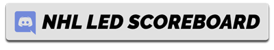
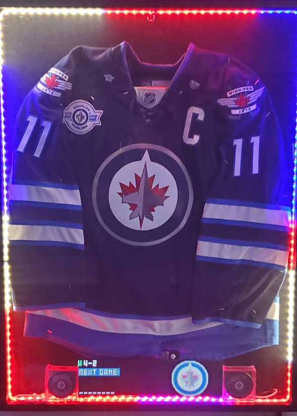
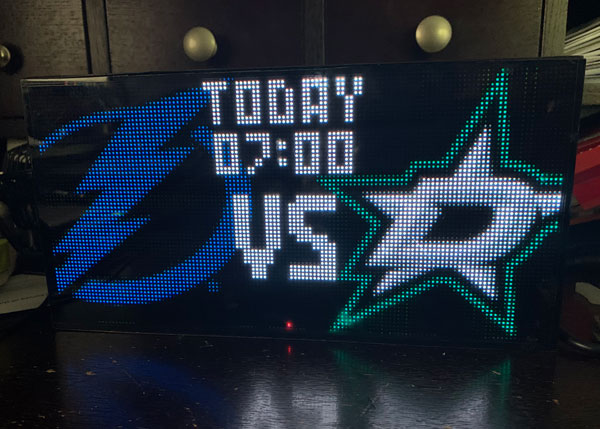
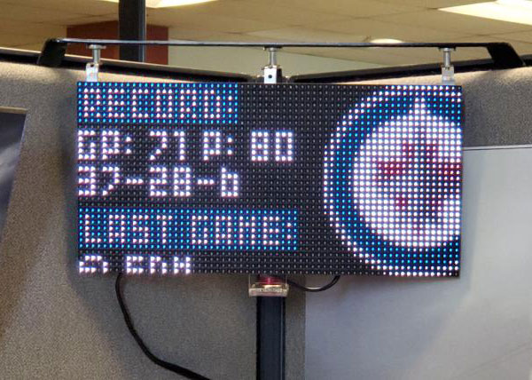

# NHL-LED-scoreboard (THIS PROJECT IS INDEFINITLY ON HOLD) 

  
  
# NHL LED Scoreboard Raspberry Pi Image

# IMPORTANT (PLEASE READ)

## (2023-11-09)
old stats api is officially dead. please read below on the current state of the project. only thing that change is that the plan is that Ill start from scratch for the next version. No time frame on anything for now for reasons stated below

## (2023-10-11) Indefinitly on Hold. More changes and complications. Limited free time. Future uncertain (Don't build this for a friend).
Over the last few weeks, we discovered that the NHL API has changed to a new one and the previous version is now unreliable (even tho it came back to life after being out for a few days). More so, a lot of packages, plugins and more recently, the OS we use had a major update and the software stack we use to make this project work changed a lot. This means that the current documentation of this project is now partially deprecated. If you have enough know-how, you can make the project work. Due to unforeseen events in my life, I no longer have the same amount of free time to dedicate to this project, keep it up to date and make it easy to use. 

The current situation is, that if you have a working scoreboard, it should be fine while the previous NHL API is operational. If your scoreboard is not working at the moment, you may try the image version of the scoreboard offered by Falkyre. He's currently working on fixing a few things related to software changes and OS changes, but I believe he will have it up and running in the coming days. Again, this uses the previous version of the NHL API and thus, its fate is the same. 

What I'm focusing on with the little time I find is fixing the code of this project to use the new NHL API. This will take a bit of time. 

## Compatible Raspberry pi OS
For v1.6.x and lower, use Raspberry Pi OS Lite (Legacy). The newer version of Raspberry pi OS (Bullseye) is not supported at the moment.

### Supported Raspberry Pi models

The models we support are the Raspberry Pi Zero 2W, all the Raspberry pi 3 and the Pi 4 models. 

If you are looking to replace your raspberry pi Zero, I personally recommend the Raspberry pi 3A+. If you use the RGB Bonnet along with that, make sure to isolate the bottom of it with a few layers of Kapton tape or a layer of electrical tape.

## Description

This is a Python software made to display NHL live scores, stats, and more of your favorite teams, on a Raspberry Pi driven RGB LED matrix. An LED matrix panel (also called a Dot led matrix or dot matrix) is a panel of LEDs used to build huge displays as you see in arenas, malls, time square, etc...

## Skill requirements (PLEASE READ)
I reckon that a lot of interest come from users that have little to no experience with a raspberry pi or computers and how to set up and use electronic devices in general. To help yourself here are some basic skills you need in order to set up and use this software and the device you are about to build. 

* Basic knowledge of Bash command language and terminal navigation. Here is a starting point https://www.raspberrypi.org/documentation/linux/usage/commands.md
* Basic Knowledge of Electronics. 
* Willingness to fail and keep trying.
* (Optional but recommended) Basic soldering skill. 

This documentation offers technical information related to the installation and execution of this software only. You will need to figure out other unrelated technical processes through tutorials or searching on google.

## Disclaimer

This project relies on an undocumented NHL API which is also what nhl.com use. The data is not always accurate and might have delays and errors that's out of our control.

  

## Tutorials from other source

>"I followed instructions from somewhere else and I'm having issues"

  

This project is new and is in constant evolution. Please read the documentation and instructions to install and run this software provided here.

  

## Support and community

  

**NEW on MARCH 2 2020***
The Discord Channel still exist, But We now use the new [Discussions](https://github.com/riffnshred/nhl-led-scoreboard/discussions) section. If you need help, are looking for resources, show off your setup or want to keep up with what's going on with the project, this is where it's all about.

## Requirements

Since version V1.0.0 you need python 3.3 and up.

## Time and data accuracy
The scoreboard refreshes the data at a faster rate (15 seconds by default, don't go faster than 10). This does not change the fact that the data from the API is refreshed every minute. The faster refresh rate allows catching the new data from the API faster.

Syncing the scoreboard with a TV Broadcast is, to my knowledge, impossible. The delay between the actual game and the TV broadcast is different depending on where you are in relation to the game's location. This also means that you will see the goal animation before it happens on TV sometimes. I'm working on this issue and looking to find a solution to implement a delay at some point. 

Also, it might happen the data shown on board might be wrong for a short time, even goals. That is because the API is drunk. If you see data that might be wrong, compare it to the nhl.com and see if it's different.

## Hardware and Assembly
Please refer to the [Hardware page](https://github.com/riffnshred/nhl-led-scoreboard/wiki/Hardware) in the wiki section. You will find everything you need to order and build your scoreboard.  

**IMPORTANT NOTE**: Even tho there are other ways to run an rgb led matrix, I only support for the Adafruit HAT and Adafruit Bonnet. They have a great tutorial on how to install both of them on their website. Follow these steps until **STEP 5** to assemble your setup. https://learn.adafruit.com/adafruit-rgb-matrix-bonnet-for-raspberry-pi/driving-matrices

If you create an issue because you are having trouble running your setup and you are using something different, I will close it and tell you to buy the appropriate parts or to check the [rpi-rgb-led-matrix ](https://github.com/hzeller/rpi-rgb-led-matrix) repo.

## Software Installation

### Method 1 - Using the nhl-led-scoreboard-img (Recommended)
You can now install, connect, configure and run the scoreboard using the new [nhl-led-scoreboard-img](https://github.com/falkyre/nhl-led-scoreboard-img)
PLEASE READ THE DOCUMENTATION AND TAKE YOUR TIME TO GO THROUGH THE PROCESS.
**NOTE**: This image has been tested but is still in Beta. If you have issues, Open a new issue on His repository. 

Download the image [HERE](https://github.com/falkyre/nhl-led-scoreboard-img/releases)

**Note that this images is generated AFTER I release a new update. keep an eye on the Badges at the top of the page or on the repository it self to see when the new image comes out**

### Method 2 - Standard installation and setup (For Dev and Modders).
This is the classic way to install and configure the scoreboard. If you want to do your own thing and add or modify components to your scoreboard, I recommend fallowing this guide to install, configure and run your scoreboard. 

[Step by step installation guide](https://github.com/riffnshred/nhl-led-scoreboard/wiki/Step-by-step-guide.)

## Shout-out

First, these two for making this repo top notch and already working on future versions:

- [Josh Kay](https://github.com/joshkay)

- [Sean Ostermann](https://github.com/falkyre)

This project was inspired by the [mlb-led-scoreboard](https://github.com/MLB-LED-Scoreboard/mlb-led-scoreboard). Go check it out and try it on your board, even if you are not a baseball fan, it's amazing.

I also used this [nhlscoreboard repo](https://github.com/quarterturn/nhlscoreboard) as a guide at the very beginning as I was learning python.
You all can thank [Drew Hynes](https://gitlab.com/dword4) for his hard work on documenting the free [nhl api](https://gitlab.com/dword4/nhlapi).

## Licensing

This project uses the GNU Public License. If you intend to sell these, the code must remain open source.
