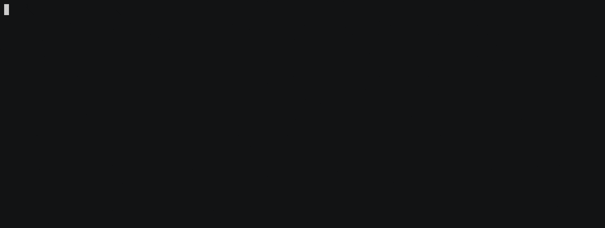

### History
* V1.6.3 - May 14, 2022
* V1.4.0 - September 25, 2020
* V1.3.0 - Wx version - May 10, 2020
* V1.2.1 - "Maple Leafs" fix - April 1, 2020
* V1.2.0 - covid 19 board configs - ntjoumas - March 31, 2020
* V1.1.0 - Error Message and readme fix - March 24, 2020
* V1.0.0 - Initial release - March 14, 2020
  
### Latest Changes

#### V1.6.3
Fix for goal animations being set to an empty dictionary

#### V1.4.1 - V1.6.2
Various fixes and updates to the setup to allow for removal of convid board, the covid divisions addition to the seasoncountdown board.

#### V1.4.0
Added in new sections for screensaver board and additions to the weather, wxalerts and dimmer board.
Can now select individual sections to update instead of doing the whole config.  The config.json is broken into the following sections: general, preferences, states, boards and sbio.  General is the first 3 items in the config.
The states, boards and sbio sections all can be configured in their respective individual sections as well.  Example:  Under boards, you will be asked which boards you want to update and only those ones will be offered to be changed.
Updated the underlying questionary library to fix some of the prompt colors.

#### V1.3.0
App now has some other functionality right from the command line, including the ability to verify your config against a schema of what the scoreboard requires, check the version of the setup app and also create a simple one team with all defaults configuration.  Here are the command line options:

```
/nhl_setup -h
usage: nhl_setup [-h] [--version] [--team TEAM] [--check] [confdir]

positional arguments:
  confdir               Input dir for config.json (defaults to config)

optional arguments:
  -h, --help            show this help message and exit
  --version, -v         show program's version number and exit
  --team TEAM, -t TEAM  Create simple config.json with defaults and one team
  --check, -c           Check config.json against schema, used to see if
                        config is out of date
```

##### Validate config.json
```./nhl_setup -c or ./nhl_setup --check```
The check functionality will check for typographical errors in your config.json that would prevent the scoreboard from running properly (these checks were also added into the main scoreboard app as well) and also checks against the latest configuration that the scoreboard needs to run (in case new sections are added as part of a release).  If there is an error, you will be shown the error and the application will exit.  There are two types of errors:

Sample Error | How to fix it 
---------|----------|
Your config.json fails validation: error: [invalid json error: Expecting ',' delimiter: line 96 column 2 (char 1712)] | There is something mistyped in your config.json, edit the config and correct |
Your config.json fails validation: error: [data must contain ['debug', 'live_mode', 'preferences', 'goal_animations', 'states', 'boards', 'sbio', 'weather'] properties] | Run the nhl_setup app to create a new valid config.json that has all of the sections in it |
 
##### Create simple config.json with one team and defaults
```./nhl_setup -t <Team Name> or ./nhl_setup --team <Team Name>```
If you run this on the command line and provide a single team name, the app will check the name against the 31 team names, if it matches, then will take the config.json.sample and generate a config.json with the team name and everything else in the config.json.sample as the default settings.

Valid Team Names:  
```
Avalanche,Blackhawks,Blues,Blue Jackets,Bruins,Canadiens,Canucks,Capitals,Coyotes,Devils,Ducks,Flames,Flyers,Golden Knights,Hurricanes,Islanders,Jets,Kings,Maple Leafs,Lightning,Oilers,Panthers,Penguins,Predators,Rangers,Red Wings,Sabres,Senators,Sharks,Stars,Wild
```

### Description 
In the score board root, there is a compiled version of the nhl_setup.py.  You can run this and it will look for a config.json or config.json.sample in the config directory (not the src/config directory).  If those files don't exist, it will present you with defaults and you can select what you want.  After answering all of the questions, the app will create a config.json in the config directory and you can then run your scoreboard.  If it finds a config.json or config.json.sample, it will use the values in those as defaults in the questions.

To run the compiled app and go through creating a config.json, do the following:

```
./nhl_setup
```

> **_NOTE:_** The compiled app may be slower on a **raspberry pi zero** than running the python code as it has to uncompress some libraries to disk first.  Running as the compiled app removes the need to do any type of package installs with pip.


##### First question you will see
The very first thing you will see is this:

🥅🏒🚨 Do you see a net,stick and horn?  (Y/n)

Hit yes it you see them.  This means your terminal has nice fancy fonts installed.  If you see something like:

   Do you see a net,stick and horn?  (Y/n)

Hit no because your terminal doesn't like fancy fonts.

You will then be asked if you want to create a simple config.json (one team) or run through the full setup:

🥅 Do you want a simple default setup with one team selection (Y) or full setup (N)?  (Y/n)

## Common error messages you might encounter
| Error Message  |  What it means |
|---|---|
| Could not make backup of config/config.json. This is normal for first run.  Message: [Errno 2] No such file or directory: 'config/config.json' |  The config.json file does not exist.  You can continue without issue. |
| Error making backup of config/config.json. Error: [Errno 2] No such file or directory: 'config/config.json' | Same as above but for older version of nhl_setup |
| PermissionError: [Errno 13] Permission denied: 'config/config.json' [3838] Failed to execute script nhl_setup | Did you create a config.json by running sudo nano config.json?  If so, run the nhl_setup app with sudo
|[3838] Failed to execute script nhl_setup| This will happen with the compiled script as there is a bug with pyinstaller and sys.exit() calls.  You can safely ignore this

>## How to create a compiled nhl_setup app
The PyInstaller package was used to created an executable app.  It was the only one that I could get to work properly.  Once you install pyinstaller (```sudo pip3 install pyinstaller```), this is the command line that I used to create an compiled version:
```
pyinstaller --onefile --add-data '/usr/local/lib/python3.7/dist-packages/pyfiglet:./pyfiglet'  nhl_setup.py
```

This will create a build and dist directory in the same directory as the nhl_setup.py.  Under the dist directory is the compiled executable. Copy this to the root directory of the scoreboard app and have it run from there.

>***NOTE:***  The executable does not handle the sys.exit() command in python correctly and will throw the error: ```Failed to execute script nhl_setup```.  This can be ignored as it is a bug in the pyinstaller utility.


##### Running as python script
If you want to run this as pure python and not the app, you will need to install the following pip3 packages:

```
fastjsonschema==2.14.4
printtools==1.2
questionary==1.5.2
regex==2020.4.4
```
As the RGB matrix library needs to run as the root user, you will need to install using sudo.  

```
sudo pip3 install printtools
sudo pip3 install questionary
sudo pip3 install regex
sudo pip3 install fastjsonschema
```

If you run the python script from the src/nhl_setup directory you will need to give the full path of the config directory so it can find the config.json.  For example:

```
python3 src/nhl_setup/nhl_setup.py /home/pi/source/nhl-led-scoreboard/config
```

If the app can't find your config directory, it will error out and tell you it can't find it.

### Generating JSON schema
The nhl_setup app can now validate a config.json against a JSON schema.  If you add sections to the config.json, you must update the config.schema.json.  You can do this by hand, or you can take your new config.json and upload it to https://jsonschema.net/home and then get the updated config.schema.json.  

